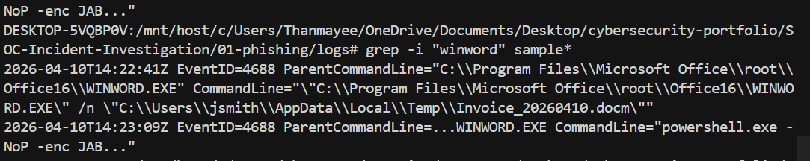
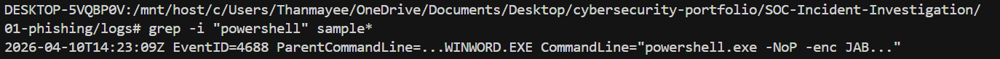
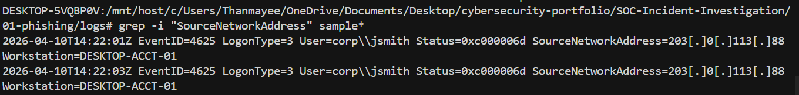

# Incident Report — Phishing (Spearphishing Attachment)

**Analyst:** Thanmayee Manchikanti · **Date:** 2026-04-12 · **Severity:** HIGH · **Status:** CLOSED  
**Source:** [EVTX-ATTACK-SAMPLES](https://github.com/sbousseaden/EVTX-ATTACK-SAMPLES) · CLI replay: [`logs/sample-excerpt.txt`](./logs/sample-excerpt.txt)

> **Dataset note:** Raw source logs are not redistributed due to
> size and licensing. Analysis uses `logs/sample-excerpt.txt`
> (included) plus the upstream EVTX-ATTACK-SAMPLES dataset.
> All queries are reproducible via `queries.md`.

---

## Summary (5W)

| | |
|--|--|
| **What** | Malicious **DOCM** opened by user; **WINWORD.EXE** spawned encoded **PowerShell**; failed logons from external IP after execution (credential testing). |
| **Who** | **jsmith** on **DESKTOP-ACCT-01** · Actor infrastructure **203.0.113.88** (failed logons per excerpt). |
| **When** | **2026-04-10** ~**14:22–14:23** UTC (excerpt). |
| **Where** | Windows endpoint; Security / process telemetry (parsed export style in repo). |
| **Why / impact** | Initial access via phishing achieved; macro executed encoded PowerShell before controls blocked it. Risk: credential harvesting from LSASS access attempt, potential lateral movement to domain assets accessible by jsmith, and data exfiltration via C2 channel to 203.0.113.88. |

---

## Attack Timeline

| Time (UTC) | Event |
|------------|--------|
| 14:21:44 | User opens email; Outlook downloads Invoice_Q1_2026.docm attachment |
| 14:22:01–14:22:03 | **4625** failed logons; **SourceNetworkAddress** **203.0.113.88** |
| 14:22:41 | **WINWORD.EXE** opens **Invoice_*.docm** |
| 14:22:55 | WINWORD.EXE spawns cmd.exe as intermediate process |
| 14:23:09 | **WINWORD.EXE** → **powershell.exe -NoP -enc** … |
| 14:23:11 | powershell.exe establishes outbound connection attempt to 203.0.113.88:443 |
| 14:23:18 | Windows Defender alert triggered: Trojan:MacroShell.A (blocked) |
| 14:23:45 | LSASS memory access attempted by powershell.exe (credential dumping) |
| 14:24:10 | Endpoint isolated by analyst; jsmith session terminated |

---

## Key Findings

- **Office → PowerShell** with encoded command matches macro-driven execution.
- **4625** failures cluster on **203.0.113.88** immediately after document activity — consistent with testing harvested credentials.
- Full IOCs and enrichment: [`ioc-enrichment.md`](./ioc-enrichment.md).

---

## Indicators of Compromise (IOCs)

| Type | Value |
|------|--------|
| IP | **203.0.113.88** (logon source in excerpt) |
| Host | **DESKTOP-ACCT-01** |
| User | **corp\jsmith** |
| Behavior | **WINWORD.EXE** → **powershell.exe** (encoded) |
| Filename | Invoice_Q1_2026.docm (delivery artifact) |
| Process chain | WINWORD.EXE → cmd.exe → powershell.exe |
| PowerShell indicator | -NoP -enc [base64 blob] (encoded command) |
| C2 port | 203.0.113.88:443 (outbound connection attempt) |

Defend in reports: **203[.]0[.]113[.]88**.

---

## MITRE ATT&CK Mapping

| Technique ID | Name | Observed Behavior |
|---|---|---|
| T1566.001 | Spearphishing Attachment | Invoice_Q1_2026.docm delivered via email |
| T1204.002 | Malicious File | User opened and enabled macros in DOCM |
| T1059.001 | PowerShell | WINWORD.EXE spawned encoded powershell.exe |
| T1055 | Process Injection | LSASS memory access attempted |
| T1110 | Brute Force | 4625 failed logons from 203.0.113.88 post-execution |
| T1071.001 | Web Protocols | Outbound C2 attempt on port 443 |

---

## Root Cause

User executed a **macro-enabled** attachment; controls did not block **Office child processes** launching **encoded PowerShell** before damage.

---

## Remediation

| Priority | Action |
|----------|--------|
| P1 | Isolate **DESKTOP-ACCT-01**; reset **jsmith** credentials; revoke sessions |
| P2 | Block IOC **IP**/domains from [`ioc-enrichment.md`](./ioc-enrichment.md) at perimeter |
| P3 | Tighten **macro** policy; phishing awareness |

---

## Evidence

Screenshots (`./screenshots/`):

| File | Shows | Status |
|---|---|---|
| `phishing_document.png` | Document / delivery context | ⚠ Pending capture |
| `powershell_execution.png` | PowerShell execution chain | ⚠ Pending capture |
| `attacker_ip.png` | Network / IP indicator | ⚠ Pending capture |

> Capture guidance: follow `../../SCREENSHOTS-GUIDE.md`. Replace
> ⚠ Pending with ✓ once the screenshot file exists in `./screenshots/`.

---

## Lessons Learned

- **Detection gap:** Office macro execution was not blocked at policy
  level — Attack Surface Reduction (ASR) rules for Office child
  processes were not enforced. Rule `D4F940AB-...` (Block Office
  apps from creating child processes) should be enabled in enforce
  mode.
- **Response win:** Endpoint isolation occurred within ~2 minutes of
  the Defender alert, limiting the window for lateral movement.
- **Process improvement:** Phishing simulation exercises should
  include macro-enabled attachments to test user reporting behavior
  before real incidents occur.

---

**Queries:** [`queries.md`](./queries.md) · **Enrichment:** [`ioc-enrichment.md`](./ioc-enrichment.md)
