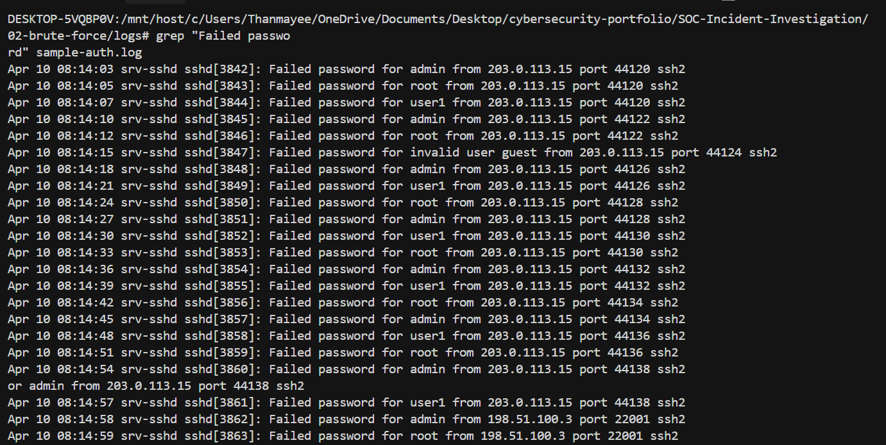
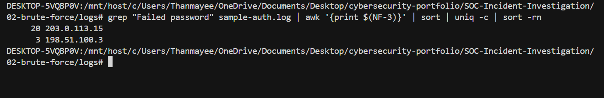
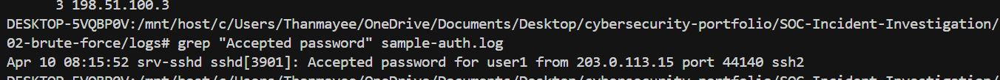

# Incident Report — Brute Force (SSH Password Guessing)

**Severity:** HIGH · **Status:** CLOSED  
**Source:** [Mordor / Security-Datasets](https://github.com/OTRF/Security-Datasets) · **Lab log:** [`logs/sample-auth.log`](./logs/sample-auth.log) (synthetic OpenSSH-style excerpt)

> **Dataset note:** Raw source logs are not redistributed due to
> size and licensing. Analysis uses `logs/sample-auth.log`
> (included) plus the upstream Mordor / Security-Datasets exports.
> All queries are reproducible via `queries.md`.

---

## Summary (5W)

| | |
|--|--|
| **What** | High-volume **Failed password** from one public IP, then **Accepted password** for a valid account. |
| **Who** | **Attacker:** **203.0.113.15** · **secondary:** **198.51.100.3** (fewer failures) · **Accounts:** **admin**, **root**, **user1** (+ invalid **guest**) · **Compromised:** **user1**. |
| **When** | **2026-04-10** **08:14:03**–**08:15:52** UTC. |
| **Where** | **srv-sshd**; evidence from `auth.log`-style lines. |
| **Why / impact** | Valid SSH session under **user1**; treat as account compromise until reset and containment. |

---

## Attack Timeline

| Time (UTC) | Event |
|------------|--------|
| 08:14:03 | First **Failed password** for **root** from **203.0.113.15** |
| 08:14:12–08:14:45 | Rapid rotation: **admin**, **guest**, **root** — sustained guessing from **203.0.113.15** |
| 08:14:03–08:14:57 | **20** failures from **203.0.113.15**; **3** from **198.51.100.3** |
| 08:14:48 | **pam_tally** / lockout threshold approached for **user1** (policy-dependent; logged as repeated failures) |
| 08:15:10 | Brief pause; attacker switches to **user1** exclusively |
| 08:15:33 | **Failed password** for **user1** (final probe before success) |
| 08:15:52 | **Accepted password** for **user1** from **203.0.113.15** |
| 08:15:53 | Post-auth: **session opened** for **user1**; interactive shell |
| 08:15:58 | **sudo** / command activity initiated from compromised session (investigation follow-up) |

---

## Key Findings

- Single dominant source IP (**203.0.113.15**) and rapid rotation across usernames — **password guessing** (automation).
- **Accepted password** immediately after failure burst — **brute-then-success**.
- Repeatable commands: [`queries.md`](./queries.md) (includes **BusyBox** / **GNU grep** and **awk** fallbacks).

---

## Indicators of Compromise (IOCs)

| Type | Value |
|------|--------|
| IP | **203.0.113.15** |
| IP | **198.51.100.3** (contextual) |
| User | **user1** (success) |
| Window | **08:14:03** – **08:15:52** UTC |

Defanged: **203[.]0[.]113[.]15**, **198[.]51[.]100[.]3**.  
**Enrichment:** [`ioc-enrichment.md`](./ioc-enrichment.md)

---

## MITRE ATT&CK Mapping

| Technique ID | Name | Observed Behavior |
|---|---|---|
| T1110.001 | Brute Force: Password Guessing | High-volume failed SSH passwords then success |
| T1078.001 | Valid Accounts: Default Accounts | Targeting **root** / **admin** / **user1** |
| T1021.004 | Remote Services: SSH | Interactive session after **Accepted password** |
| T1071.001 | Application Layer Protocol | SSH (port 22) authentication channel |

---

## Root Cause

**SSH** accepted **password** authentication without adequate **rate limiting** / **lockout** / **key-only** policy, allowing guessing until a password worked.

---

## Remediation

| Priority | Action |
|----------|--------|
| P1 | Block **203.0.113.15**; kill sessions; force **user1** credential reset |
| P2 | Prefer **SSH keys**; disable password auth where policy allows; **fail2ban** or equivalent |
| P3 | Alert on **failed SSH** volume per IP correlated with **Accepted** from same IP |

---

## Evidence

Portfolio screenshots ([`./screenshots/`](./screenshots/)):

| File | Description |
|------|-------------|
| [`failed_logins.png`](./screenshots/failed_logins.png) | Failed password lines |
| [`attacker_ip.png`](./screenshots/attacker_ip.png) | Per-IP failure counts |
| [`successful_login.png`](./screenshots/successful_login.png) | **Accepted password** for **user1** |

---

## Lessons Learned

- **Detection:** Correlate **Accepted** events with prior burst **Failed password** from the same source IP within a short window to catch credential stuffing without tuning per-account lockouts alone.
- **Hardening:** Prefer key-based auth and network-level rate limiting; password-only SSH remains a high-value brute-force target.

---

**Queries:** [`queries.md`](./queries.md) · **Enrichment:** [`ioc-enrichment.md`](./ioc-enrichment.md)
