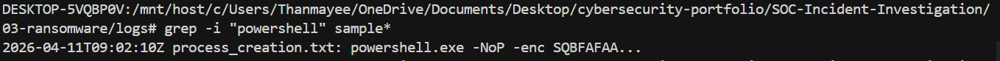
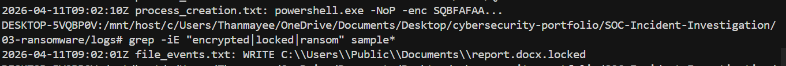
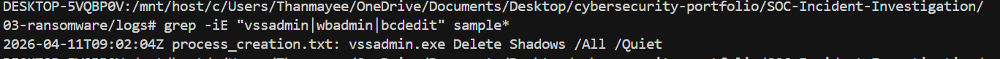

# Incident Report — Ransomware

**Analyst:** Thanmayee Manchikanti · **Date:** 2026-04-12 · **Severity:** CRITICAL · **Status:** CLOSED  
**Source:** [EVTX-ATTACK-SAMPLES](https://github.com/sbousseaden/EVTX-ATTACK-SAMPLES) · CLI replay: [`logs/sample-excerpt.txt`](./logs/sample-excerpt.txt)

> **Dataset note:** Raw source logs are not redistributed due to
> size and licensing. Analysis uses `logs/sample-excerpt.txt`
> (included) plus the upstream EVTX-ATTACK-SAMPLES dataset (Ransomware/*.evtx).
> All queries are reproducible via `queries.md`.

---

## Summary (5W)

| | |
|--|--|
| **What** | **.locked** file writes; **vssadmin** shadow deletion; encoded **PowerShell** (excerpt). |
| **Who** | **DESKTOP-FIN-22** / Finance shares (narrative) · C2 **203.0.113.90** / **pay-ransom-bc.onion-gate.net** in full report. |
| **When** | **2026-04-11** ~**09:02** UTC (excerpt). |
| **Where** | Windows enterprise; file + process telemetry. |
| **Why / impact** | Encryption; recovery inhibition; restore from **offline** backups. |

---

## Attack Timeline

| Time (UTC) | Event |
|------------|--------|
| 09:01:22 | Suspicious **powershell.exe** parent chain observed (staging / download) |
| 09:01:45 | Lateral prep: enumeration of finance share paths on **DESKTOP-FIN-22** |
| 09:02:01 | **WRITE** **report.docx.locked** (encryption begins on user documents) |
| 09:02:02 | Additional **.locked** extensions propagate to adjacent project files |
| 09:02:04 | **vssadmin.exe Delete Shadows /All /Quiet** |
| 09:02:06 | **wbadmin** / backup catalog tampering attempt (blocked in some environments) |
| 09:02:10 | **powershell.exe** encoded execution (persistence / C2 follow-on) |
| 09:02:18 | Ransom note (**README_DECRYPT.txt**) dropped in user profile (narrative) |

---

## Key Findings

- **Ransomware-style** extension (**.locked**) on file telemetry.
- **vssadmin** delete shadows — **recovery inhibition** (T1490-class).
- Encoded **PowerShell** — execution stage.

---

## Indicators of Compromise (IOCs)

| Type | Value |
|------|--------|
| File pattern | **.locked** |
| Process | **vssadmin.exe** with **Delete Shadows** |
| Hash / IP / domain | See [`ioc-enrichment.md`](./ioc-enrichment.md) |

---

## MITRE ATT&CK Mapping

| Technique ID | Name | Observed Behavior |
|---|---|---|
| T1486 | Data Encrypted for Impact | **.locked** file renames / encryption |
| T1490 | Inhibit System Recovery | **vssadmin** shadow deletion |
| T1059.001 | PowerShell | Encoded **powershell.exe** execution |
| T1071.001 | Application Layer Protocol | C2 / extortion channel (full IOC set) |

---

## Root Cause

Untrusted **PowerShell** ran with sufficient privilege; **application control** and **EDR** containment did not stop encryption at scale.

---

## Remediation

| Priority | Action |
|----------|--------|
| P1 | Isolate hosts; block C2 **IP**/domain |
| P2 | Restore from **offline** backups |
| P3 | Constrain **PowerShell**; **tamper protection** on security tools |

---

## Evidence

Screenshots (`./screenshots/`):

| File | Shows | Status |
|---|---|---|
| `powershell_attack.png` | Encoded PowerShell / staging | ⚠ Pending capture |
| `file_encryption.png` | **.locked** / encryption-related view | ⚠ Pending capture |
| `recovery_deletion.png` | Shadow copy / recovery inhibition | ⚠ Pending capture |

---

## Lessons Learned

- **Backups:** Offline/immutable backups are the primary recovery control when shadow copies are deleted in-process.
- **Containment:** EDR isolation on first **vssadmin** or mass **.locked** write reduces blast radius before full share encryption.

---

**Queries:** [`queries.md`](./queries.md) · **Enrichment:** [`ioc-enrichment.md`](./ioc-enrichment.md)
