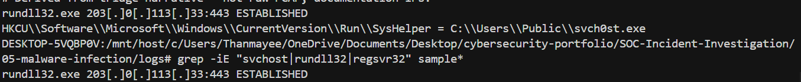
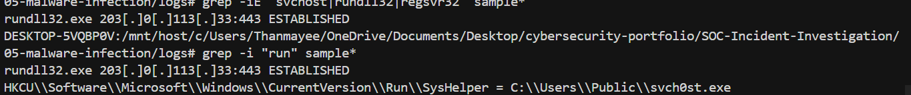
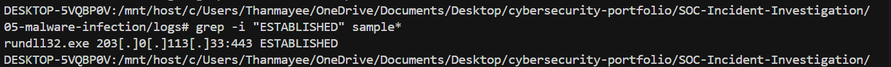

# Incident Report — Malware Infection (C2 & Persistence)

**Analyst:** Thanmayee Manchikanti · **Date:** 2026-04-12 · **Severity:** HIGH · **Status:** CLOSED  
**Source:** [Malware Traffic Analysis](https://www.malware-traffic-analysis.net) · Text triage: [`logs/sample-excerpt.txt`](./logs/sample-excerpt.txt) (not raw PCAP)

> **Dataset note:** Raw source logs are not redistributed due to
> size and licensing. Analysis uses `logs/sample-excerpt.txt`
> (included) plus PCAP and alerts from Malware Traffic Analysis exercises.
> All queries are reproducible via `queries.md`.

---

## Summary (5W)

| | |
|--|--|
| **What** | **rundll32** with **ESTABLISHED** session to **203.0.113.33:443**; **Run** key persistence to **Users\Public\svch0st.exe**. |
| **Who** | **WIN-PROC-09** (narrative) · C2 **203.0.113.33**; domain **malware-drop-example.com** in full IOC set. |
| **When** | **2026-04-08** **14:00–14:10** UTC (narrative). |
| **Where** | Corporate egress; PCAP + endpoint telemetry (investigation style). |
| **Why / impact** | Persistence and C2; isolate host and remove persistence. |

---

## Attack Timeline

| Time (UTC) | Event |
|------------|--------|
| 14:00:05 | User browses compromised site; initial HTTP GET to **malware-drop-example.com** |
| 14:00:22 | Malicious **ZIP** / dropper retrieved; saved to **%TEMP%** |
| 14:01:10 | **svch0st.exe** written to **Users\Public\** |
| 14:01:35 | **HKCU\Run\SysHelper** persistence established |
| 14:02:48 | **rundll32.exe** launched with suspicious DLL path |
| 14:05:12 | **ESTABLISHED** TCP to **203.0.113.33:443** (C2 beaconing) |
| 14:07:30 | Periodic beacon interval observed in PCAP (keep-alive) |
| 14:09:01 | Secondary DNS lookup to C2-related FQDN (enrichment narrative) |
| 14:10:00 | EDR / analyst triage window; host flagged for isolation |

---

## Key Findings

- C2 **IP:port** in excerpt matches **203.0.113.33:443**.
- **Run** key **SysHelper** points to **Users\Public\svch0st.exe**.
- Details: [`queries.md`](./queries.md) · hashes: [`ioc-enrichment.md`](./ioc-enrichment.md).

---

## Indicators of Compromise (IOCs)

| Type | Value |
|------|--------|
| IP:port | **203.0.113.33:443** |
| Registry | **Run\SysHelper** → **svch0st.exe** |
| Process | **rundll32.exe** (network) |

---

## MITRE ATT&CK Mapping

| Technique ID | Name | Observed Behavior |
|---|---|---|
| T1189 | Drive-by Compromise | Initial delivery via browser / download |
| T1218.011 | Rundll32 | **rundll32** with outbound C2 |
| T1547.001 | Registry Run Keys | **SysHelper** → **svch0st.exe** |
| T1071.001 | Application Layer Protocol | HTTPS beacon to **203.0.113.33:443** |

---

## Root Cause

No effective **application control** blocking **LOLBins** with outbound C2 from user-driven delivery.

---

## Remediation

| Priority | Action |
|----------|--------|
| P1 | Isolate host; block **203.0.113.33** / domain |
| P2 | Remove **SysHelper**; delete **svch0st.exe** |
| P3 | Browser hardening; ASR-style rules |

---

## Evidence

Screenshots (`./screenshots/`):

| File | Shows | Status |
|---|---|---|
| `suspicious_process.png` | Suspicious process context | ⚠ Pending capture |
| `persistence_registry.png` | **Run** key persistence | ⚠ Pending capture |
| `beaconing_traffic.png` | Beaconing / C2 traffic | ⚠ Pending capture |

---

## Lessons Learned

- **Network:** Egress allowlisting or proxy inspection for rare **ESTABLISHED** long-lived sessions to unknown IPs on **443** improves C2 detection.
- **Endpoint:** ASR-style rules that restrict **rundll32** network activity reduce dwell time for DLL-loaded malware.

---

**Queries:** [`queries.md`](./queries.md) · **Enrichment:** [`ioc-enrichment.md`](./ioc-enrichment.md)
