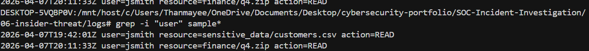
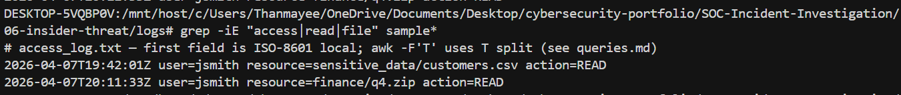

# Incident Report — Insider Threat

**Severity:** HIGH · **Status:** CLOSED  
**Source:** [Mordor / Security-Datasets](https://github.com/OTRF/Security-Datasets) · CLI replay: [`logs/sample-excerpt.txt`](./logs/sample-excerpt.txt)

> **Dataset note:** Raw source logs are not redistributed due to
> size and licensing. Analysis uses `logs/sample-excerpt.txt`
> (included) plus the upstream Mordor / Security-Datasets exports.
> All queries are reproducible via `queries.md`.

---

## Summary (5W)

| | |
|--|--|
| **What** | **jsmith** read **sensitive_data/customers.csv** and **finance/q4.zip** in a short window (access log excerpt). |
| **Who** | **jsmith** · Insider process per **HR/legal** (narrative). |
| **When** | **2026-04-07** **19:42** and **20:11** UTC (excerpt). |
| **Where** | File share / access logs; VPN **198.51.100.44** in full report. |
| **Why / impact** | Unauthorized or policy-violating access to sensitive data; escalate per insider playbook. |

---

## Attack Timeline

| Time (UTC) | Event |
|------------|--------|
| 19:40:15 | **jsmith** VPN session established from **198.51.100.44** |
| 19:41:02 | Browse to **\\fileserver\shared** — directory listing of top-level shares |
| 19:41:48 | Navigation into **sensitive_data** folder (access audit event) |
| 19:42:01 | **READ** **sensitive_data/customers.csv** |
| 19:55:30 | Access to **finance** share (intermediate enumeration) |
| 20:05:12 | Large **READ** burst on **finance** subtree (staging suspicion) |
| 20:11:33 | **READ** **finance/q4.zip** |
| 20:14:00 | Session remains active; flagged for HR / insider review |

---

## Key Findings

- Same user (**jsmith**) touched **customer** and **finance** paths in **~30 minutes** — priority for access review.
- **grep** / **awk** patterns: [`queries.md`](./queries.md).
- Broader narrative (mail/S3): **full report** + [`ioc-enrichment.md`](./ioc-enrichment.md). Excerpt is **two lines** only.

---

## Indicators of Compromise (IOCs)

| Type | Value |
|------|--------|
| User | **jsmith** |
| Paths | **sensitive_data/customers.csv**, **finance/q4.zip** |
| VPN IP | **198.51.100.44** (full narrative) |

---

## MITRE ATT&CK Mapping

| Technique ID | Name | Observed Behavior |
|---|---|---|
| T1078 | Valid Accounts | **jsmith** legitimate credentials used for access |
| T1039 | Data from Network Shared Drive | **READ** of **customers.csv** and **q4.zip** |
| T1083 | File and Directory Discovery | Share and folder navigation before reads |
| T1048 | Exfiltration Over Alternative Protocol | Follow-on risk if data copied off-share (monitor DLP) |

---

## Root Cause

**Standing access** to sensitive data without **just-in-time** controls or **DLP** on exfil paths.

---

## Remediation

| Priority | Action |
|----------|--------|
| P1 | Suspend **jsmith**; preserve logs; **HR/legal** |
| P2 | **DLP** for bulk / sensitive paths |
| P3 | **JIT** access to **sensitive_data** |

---

## Evidence

Portfolio screenshots ([`./screenshots/`](./screenshots/)):

| File | Description |
|------|-------------|
| [`user_activity.png`](./screenshots/user_activity.png) | User / timeline activity |
| [`sensitive_access.png`](./screenshots/sensitive_access.png) | Sensitive resource access |

---

## Lessons Learned

- **Access:** Just-in-time elevation to **finance** and **customer** paths reduces standing abuse of valid accounts.
- **Monitoring:** Correlate **VPN** source with anomalous **READ** volume on sensitive shares within one session.

---

**Queries:** [`queries.md`](./queries.md) · **Enrichment:** [`ioc-enrichment.md`](./ioc-enrichment.md)
