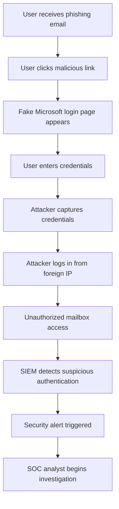

# Phishing Attack Flow Diagram

This diagram illustrates the attack flow of a phishing incident investigated in the **SOC Incident Investigation Lab**.

The attack begins with a phishing email delivered to the victim and ends with detection by the SIEM system after suspicious authentication activity.

---

## Attack Flow

---

## Attack Explanation

### 1. Phishing Email Delivery
The attacker sends a phishing email impersonating a trusted service such as Microsoft.

### 2. Malicious Link Click
The victim clicks a link that redirects them to a fraudulent login page.

### 3. Credential Harvesting
The user unknowingly submits credentials on the fake login page.

### 4. Credential Capture
The attacker collects the submitted credentials.

### 5. Account Takeover
Using the stolen credentials, the attacker logs in from a foreign IP address.

### 6. Detection
The SIEM detects abnormal login behavior and generates an alert for investigation.

---

## MITRE ATT&CK Techniques

| Technique | ID |
|-----------|----|
| Phishing | T1566 |
| Credential Harvesting | T1056 |
| Valid Accounts | T1078 |
| Account Discovery | T1087 |

---

## Purpose of this Diagram

This attack flow helps visualize how phishing attacks progress and where security monitoring tools such as SIEM systems can detect suspicious activity.

Understanding the attack flow enables security teams to improve detection, response, and prevention strategies.
