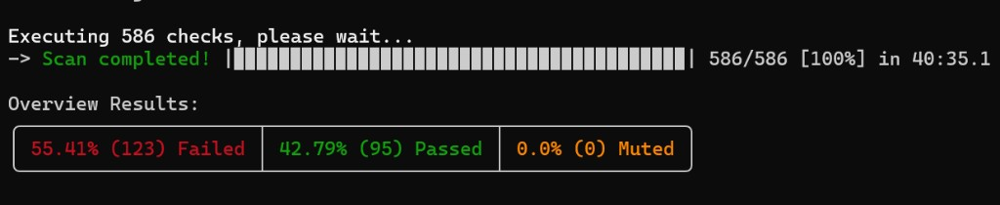
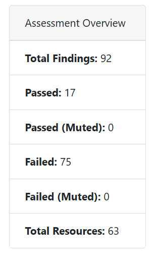
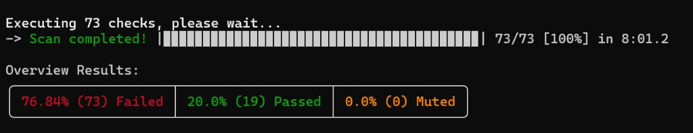
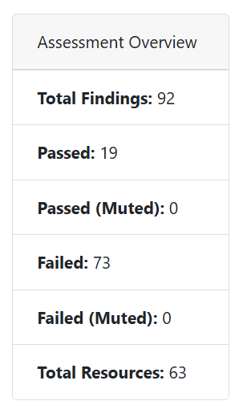

# AWS Security Audit with Prowler

## Overview

This project captures a hands-on AWS security assessment using Prowler to identify misconfigurations, apply targeted remediation, and validate the delta with before/after scan exports.

The scope is intentionally lab-based but follows the same flow used in real audits: define controls, collect evidence, remediate prioritized risk, and clearly document residual gaps.

## Tools Used

- Prowler
- AWS CLI
- PowerShell scripts

## Methodology

1. Established a controlled misconfiguration baseline in a lab AWS account.
2. Executed a pre-remediation Prowler scan and captured baseline evidence.
3. Applied scoped remediation actions for prioritized CIS control gaps.
4. Executed a post-remediation Prowler scan to validate control movement.

Notes:
- The initial scan evidence includes a broader run snapshot.
- The post-remediation comparison in the formal report uses the CIS-aligned project metrics (`reports/before-metrics.json` vs `reports/after-metrics.json`).
- On Windows, Prowler’s UTF-8 progress output could throw encoding errors until the shell code page was set to UTF-8, and some runs appended a second JSON blob into the same `*.ocsf.json` file — which broke parsers until I cleared prior outputs each run and ran the sanitizer script so every export stayed a single valid array.

## Remediation Scope (Important Context)

This assessment focused on remediating high-impact CIS controls such as IAM, root MFA, S3 exposure, and network access. Remaining findings reflect additional controls outside the scoped remediation set for this lab.

Remediation in this project was intentionally scoped to demonstrate targeted risk reduction, not full account hardening across all AWS services and regions.

## Results

- Broader initial scan snapshot (evidence screenshot): **123 failed, 95 passed** — *This covers all Prowler checks across the account; the CIS-scoped comparison uses only the 73 cis_2.0_aws checks tracked in the metrics files.*
- CIS-aligned comparison (from metrics JSON used in report):
  - Before: **75 failed, 17 passed, 3 manual**
  - After: **73 failed, 19 passed, 3 manual**

These numbers reflect what was observed in this scoped audit run, with a reduction in failing checks after remediation on the CIS extract.

Remaining FAIL findings in the after scan are expected for this lab scope and primarily represent controls not included in the remediation subset.

## Key Findings

- IAM misconfigurations and administrative privilege exposure
- S3 access control / public exposure risk
- Logging and monitoring gaps (CloudTrail/CloudWatch coverage)
- Root MFA not enabled (critical finding)

## Limitation

Root MFA could not be enabled during this engagement due to account/session constraints.  
This reflects a common enterprise operating model where engineering and security teams work through scoped IAM access, while root-level actions require separate privileged approval and execution paths.
In other words, the technical fix is straightforward, but ownership and access boundaries can still delay closure.

## What I Would Do in a Production Environment

- Enable continuous monitoring with AWS Security Hub and GuardDuty.
- Implement automated remediation workflows using AWS Lambda and AWS Config Rules so the same fixes fire again when drift shows up.
- Integrate cloud security findings into a SIEM pipeline for centralized alerting, triage, and incident response.
- Apply organization-wide preventive guardrails with AWS Organizations and Service Control Policies (SCPs).

## Screenshots

Before-scan evidence:

After-scan evidence:

## Conclusion

This project walks through assess → remediate → re-scan with real constraints (including controls I could not close from my IAM session). The repo keeps an honest list of what stayed FAIL after the second run so nobody has to guess what is still open.
