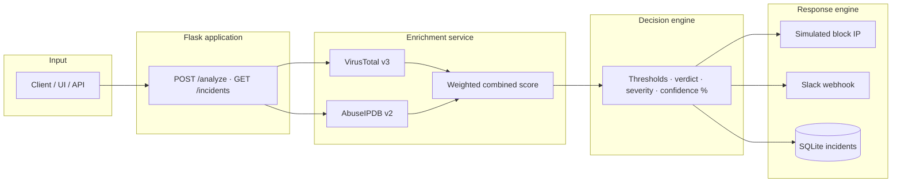
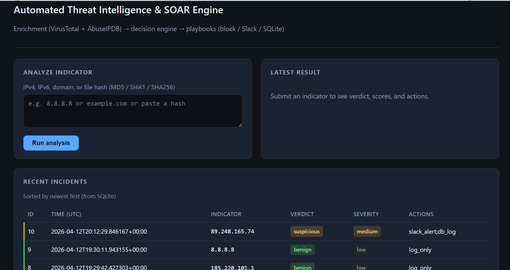
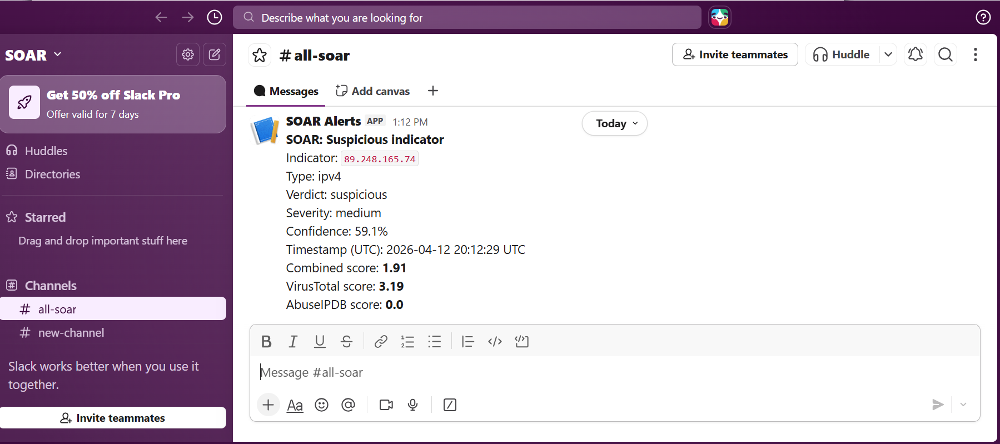

<div align="center">

# ⚡ Automated Threat Intelligence & SOAR Engine


**Ingest indicators → enrich with VirusTotal & AbuseIPDB → classify risk → automate response (Slack + SQLite).**


[Features](#-features) · [Architecture](#-architecture) · [Quick start](#-quick-start) · [API](#-api-reference) · [Impact](#-resume--impact)

</div>

---

## 🔐 What it is

This project is a **modular SOAR-style engine**: it accepts **IPs, domains, and file hashes**, queries **external threat intelligence**, applies a **configurable decision model**, and runs **playbooks** simulated IP blocking, **Slack** notifications, and **persistent incident logging** behind a clean **Flask REST API** and a **browser dashboard**.

---

## 📊 Architecture

### Mermaid — end-to-end flow



### Text overview

| Layer | Role |
|--------|------|
| **API & UI** | Validates input, returns JSON + optional dashboard |
| **Enrichment** | Normalizes VT + Abuse scores to 0–100; combines with weights for IPs |
| **Decision** | Maps score to `benign` / `suspicious` / `malicious` + severity |
| **Response** | Playbooks: block (IP) · Slack · DB log |
| **Observability** | Structured JSON logs + console |

---

## 🚀 Features

- 🔎 **Multi-type indicators** — IPv4, IPv6, domains, MD5 / SHA1 / SHA256
- 🌐 **Threat intel** — VirusTotal (IP, domain, file); AbuseIPDB (IP reputation)
- ⚖️ **Weighted scoring** — Configurable VT / Abuse blend (default 0.6 / 0.4 for IPs)
- 🧠 **Decision engine** — Verdict, severity (low / medium / high), confidence (0–100%)
- 🤖 **SOAR playbooks** — Malicious → block + Slack + DB; suspicious → Slack + DB; benign → DB
- 💬 **Slack alerts** — Incoming Webhook for high-signal events
- 💾 **SQLite persistence** — Incident history for audit and UI table
- 📜 **Structured logging** — JSON lines for pipelines and dashboards
- 🔄 **Resilience** — Timeouts, exponential backoff, `429` / `Retry-After` handling

---

## 🛠 Tech stack

| Category | Technologies |
|----------|----------------|
| **Language** | Python 3.10+ |
| **Web** | Flask |
| **HTTP** | `requests` |
| **Config** | `python-dotenv`, `config/thresholds.json` |
| **Storage** | SQLite (`sqlite3`) |
| **External APIs** | VirusTotal v3, AbuseIPDB v2, Slack Incoming Webhooks |

---

## 🔄 How it works (step by step)

1. **Submit** an indicator via `POST /analyze` or the web UI.
2. **Detect type** — Classify as `ipv4`, `ipv6`, `domain`, or hash variant.
3. **Enrich** — Call VirusTotal for the right entity; call AbuseIPDB for IPs only.
4. **Score** — Compute `vt_score`, `abuse_score` (if IP), and **combined_score** using weights.
5. **Decide** — Compare scores to `suspicious_min` / `malicious_min` in `config/thresholds.json`.
6. **Respond** — Run the playbook (block simulation, Slack, SQLite).
7. **Observe** — Log decisions and actions; list incidents via `GET /incidents`.

---

## 📁 Project structure

```
soar-engine/
├── app/
│   ├── main.py              # Flask entrypoint
│   ├── config.py            # Env + thresholds
│   ├── routes.py            # API + dashboard
│   ├── env_bootstrap.py     # .env loading
│   ├── utils/
│   │   ├── api_clients.py   # VirusTotal, AbuseIPDB
│   │   ├── logger.py
│   │   └── slack_alerts.py
│   ├── services/
│   │   ├── enrichment.py
│   │   ├── decision_engine.py
│   │   └── response_engine.py
│   └── models/
│       └── incident.py
├── config/
│   └── thresholds.json
├── data/                    # SQLite DB (gitignored)
├── docs/
│   ├── README.md            # Screenshot & asset notes
│   └── images/              # Place portfolio screenshots here
├── logs/                    # Runtime logs (gitignored)
├── requirements.txt
├── .env.example
└── README.md
```

---

## ⚙️ Quick start

### Prerequisites

- Python **3.10+**
- API keys (free tiers available): [VirusTotal](https://www.virustotal.com/gui/my-apikey), [AbuseIPDB](https://www.abuseipdb.com/account/api), optional [Slack webhook](https://api.slack.com/messaging/webhooks)

### Setup

```bash
cd soar-engine
python -m venv .venv
# Windows: .venv\Scripts\activate
# macOS/Linux: source .venv/bin/activate
pip install -r requirements.txt
copy .env.example .env   # Windows — use cp on Unix
```

Edit `.env` and set (use **your** keys — never commit real values):

```env
VIRUSTOTAL_API_KEY=YOUR_VIRUSTOTAL_API_KEY
ABUSEIPDB_API_KEY=YOUR_ABUSEIPDB_API_KEY
SLACK_WEBHOOK_URL=YOUR_SLACK_WEBHOOK_URL
```

### Run

```bash
python -m app.main
```

Open **http://127.0.0.1:5000/** for the dashboard.

---

## 📡 API reference

### `POST /analyze`

**Body (JSON)**

```json
{ "indicator": "8.8.8.8" }
```

### `GET /incidents`

Optional: `?limit=50`

---

### Examples — curl (Unix / Git Bash)

```bash
curl -s -X POST http://127.0.0.1:5000/analyze \
  -H "Content-Type: application/json" \
  -d '{"indicator":"8.8.8.8"}'
```

```bash
curl -s http://127.0.0.1:5000/incidents
```

---

### Examples — PowerShell

```powershell
Invoke-RestMethod -Uri "http://127.0.0.1:5000/analyze" `
  -Method Post -ContentType "application/json" `
  -Body '{"indicator":"8.8.8.8"}'
```

```powershell
Invoke-RestMethod -Uri "http://127.0.0.1:5000/incidents" -Method Get
```

---

### Sample JSON response (shape)

```json
{
  "indicator": "8.8.8.8",
  "enrichment": {
    "indicator_type": "ipv4",
    "vt_score": 0.0,
    "abuse_score": 0.0,
    "combined_score": 0.0
  },
  "decision": {
    "verdict": "benign",
    "severity": "low",
    "confidence": 92.5
  },
  "action_list": [
    { "action": "log_incident", "status": "stored", "incident_id": 1 }
  ]
}
```

*Live scores depend on threat intel data and your thresholds.*

---

## 🖼 Screenshots

Screenshots below show the dashboard and Slack alert generated by the system.

| Placeholder | Description |
|-------------|-------------|
| Dashboard |  |
| Slack alert |  |
---

## 📌 Resume & impact

- Designed and implemented a **SOAR-style automation pipeline** (enrichment → decision → response) in **Python/Flask**
- Integrated **commercial/community threat intelligence APIs** (VirusTotal, AbuseIPDB) with **retries, timeouts, and rate-limit handling**
- Built a **rule-based decision engine** with **configurable thresholds** and **confidence scoring**
- Delivered **real-time alerting** via **Slack webhooks** and **audit-ready incident storage** in **SQLite**
- Produced **structured JSON logging** and a **demo dashboard** for stakeholder presentations
- Applied **security hygiene**: secrets via environment variables, input validation, no hardcoded keys

---

## 🔮 Future improvements

- [ ] JWT or API-key auth for production deployments
- [ ] PostgreSQL / cloud storage for multi-instance scale
- [ ] Additional TI feeds (OTX, GreyNoise) as plug-in modules
- [ ] Celery/RQ for async enrichment under load
- [ ] Prometheus metrics + OpenTelemetry tracing
- [ ] Docker Compose for one-command demos
---

## 🙋 Author

Thanmayee,

Cybersecurity Engineer focused on threat detection, incident response, and automation.

---

<p align="center">
  <b>If this repo helped you, consider starring it on GitHub.</b> ⭐
</p>
